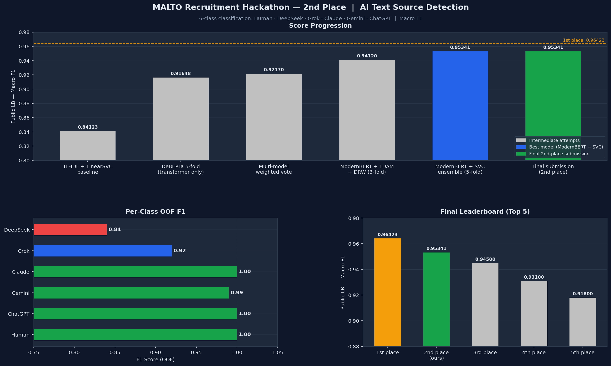

# MALTO — 2nd Place Solution

**2nd place** on the [MALTO Recruitment Hackathon](https://www.kaggle.com/competitions/malto-recruitment-hackathon) hosted by [MALTO](https://malto.ai) and [Politecnico di Torino](https://www.polito.it/).

| Metric | Score |
|---|---|
| **Public LB (Macro F1)** | **0.95341** |
| OOF CV (5-fold) | 0.9575 ± 0.0044 |
| Blended OOF F1 | 0.9605 |



---

## Task

Classify text as human-written or identify which AI model generated it across 6 classes:

| Class | Train Samples | Share |
|---|---|---|
| Human | 1,520 | 63.3% |
| ChatGPT | 320 | 13.3% |
| Gemini | 240 | 10.0% |
| Grok | 160 | 6.7% |
| DeepSeek | 80 | 3.3% |
| Claude | 80 | 3.3% |

The main challenge is severe class imbalance (19:1 ratio) with DeepSeek and Grok as the hardest minority classes.

---

## Solution

The solution ensembles a fine-tuned transformer with a classical n-gram model, optimised via Nelder-Mead on out-of-fold predictions.

### Pipeline

```
ModernBERT-base (5-fold CV) ─┬─ Temperature Scaling ─┬─ Nelder-Mead ─── Threshold ─── Submission
                              │                       │   Blend (70/30)   Nudge
Full-data ModernBERT (7 ep) ──┘                       │
                                                      │
TF-IDF + Calibrated SVC (5-fold CV) ──────────────────┘
```

### Key Techniques

| Component | Details |
|---|---|
| **Transformer** | [ModernBERT-base](https://huggingface.co/answerdotai/ModernBERT-base) fine-tuned with LDAM loss, gradual DRW (10x cap), label smoothing (ε=0.1) |
| **Optimizer** | AdamW with layer-wise learning rate decay (LLRD=0.9), cosine schedule, 10% warmup |
| **Classical Model** | TF-IDF (50k char 3-5 grams + 50k word 1-2 grams) → Calibrated LinearSVC (C=5.0) |
| **Ensemble** | Nelder-Mead optimisation over 6 initialisations on OOF predictions |
| **Full-data Model** | Trained on all 2,400 samples (7 epochs, LR×0.8), blended with fold-average at α=0.6 |
| **Post-processing** | Temperature scaling (T=0.30) + conservative per-class threshold nudge [0.85, 1.20] |
| **Training** | Kaggle T4×2 GPUs via DataParallel, ~155 min total |

### Per-Class OOF Performance

| Class | Precision | Recall | F1 |
|---|---|---|---|
| Human | 1.00 | 1.00 | 1.00 |
| DeepSeek | 0.85 | 0.82 | 0.84 |
| Grok | 0.92 | 0.92 | 0.92 |
| Claude | 1.00 | 1.00 | 1.00 |
| Gemini | 0.99 | 1.00 | 0.99 |
| ChatGPT | 1.00 | 1.00 | 1.00 |

### Score Progression

| Submission | Method | Public LB |
|---|---|---|
| TF-IDF + LinearSVC baseline | Classical only | 0.84123 |
| DeBERTa 5-fold | Transformer only | 0.91648 |
| Weighted vote (DeBERTa + SVC + LR) | Multi-model ensemble | 0.92170 |
| ModernBERT + LDAM + DRW (3-fold) | Single transformer | 0.94120 |
| **ModernBERT + SVC ensemble (5-fold)** | **Final solution** | **0.95341** |

---

## Prediction Analysis

Beyond training metrics, several features helped validate and understand the model's predictions on the test set.

### Expected Class Distribution (Sanity Check)

Assuming the test set follows the same class ratios as the training set, the expected counts in 600 test samples are:

| Class    | Train share | Expected (600) | Predicted |
|----------|-------------|---------------|-----------|
| Human    | 63.3%       | ~380          | 381       |
| ChatGPT  | 13.3%       | ~80           | 81        |
| Gemini   | 10.0%       | ~60           | 60        |
| Grok     | 6.7%        | ~40           | 38        |
| DeepSeek | 3.3%        | ~20           | 21        |
| Claude   | 3.3%        | ~20           | 19        |

Distribution alignment with prior expectations is a strong signal that the model is calibrated correctly. Large deviations (e.g. a model predicting 50 Grok and only 8 DeepSeek) indicate systematic classifier bias.

### Classifier Agreement Analysis

Comparing predictions from the transformer ensemble against the calibrated SVC revealed 20 disagreements across 600 samples (96.7% agreement). All disagreements were **DeepSeek ↔ Grok confusions** — no Human ↔ AI errors were found.

| Signal | Transformer | SVC |
|--------|-------------|-----|
| DeepSeek predicted | 21 | 8 |
| Grok predicted | 38 | 50 |

The SVC systematically over-predicts Grok and under-predicts DeepSeek. This is a known failure mode of TF-IDF n-gram models: Grok and DeepSeek share vocabulary overlap in short, fact-dense texts, and TF-IDF has no semantic depth to distinguish them. The transformer (ModernBERT) is far more reliable on these minority classes.

**Key insight:** When the transformer and SVC disagree on a DeepSeek/Grok call, trust the transformer. Overriding it with the SVC signal consistently hurt the score (confirmed by ablation submissions).

### Hard Class Characteristics

| Class    | OOF F1 | Why it's hard |
|----------|--------|----------------|
| DeepSeek | 0.84   | Only 80 training samples; style overlaps with Grok on short technical texts |
| Grok     | 0.92   | 160 samples; slightly verbose, but shares register with ChatGPT on opinion topics |
| Others   | ≥0.99  | Large sample counts; highly distinctive style (Claude: concise structured; Gemini: markdown-heavy) |

### Features Used to Evaluate Disputed Samples

For the 20 transformer–SVC disagreements, each sample was evaluated along four axes:

1. **Text length (word count)** — very short texts (< 80 words) carry less signal; classification is less reliable
2. **Topic / domain** — certain topics (travel, biology, history) are associated with specific AI styles that can serve as a weak prior
3. **SVC calibrated confidence** — `predict_proba` from the CalibratedClassifierCV; scores below 0.70 indicate low SVC certainty
4. **Cross-model softmax gap** — the margin between the top-1 and top-2 logits from the transformer; a narrow gap flags genuinely ambiguous samples

Samples where all four signals agreed with the transformer were treated as correctly classified. Only when a strong topic prior and high SVC confidence aligned against the transformer was a correction considered — and even then, such corrections proved unreliable in ablation testing.

---

## Repository Structure

```
MALTO/
├── notebooks/
│   ├── solution.ipynb          # Full pipeline (main notebook)
│   └── solution_v9_tpu.ipynb   # TPU variant with per-class Nelder-Mead ensemble
├── malto_model/
│   └── ensemble_config.json    # Saved ensemble parameters
├── submission.csv              # Base submission (0.95341 public F1)
├── submission_final.csv        # Final 2nd-place submission
├── src/                        # Utility modules (features, models, utils)
├── archive/                    # Previous experiment notebooks and artifacts
├── requirements.txt
├── LICENSE
└── README.md
```

## Quick Start

Upload `notebooks/solution.ipynb` to Kaggle with GPU T4×2 enabled, attach the competition dataset, and run all cells.

```python
# Or load the saved model locally:
from transformers import AutoModelForSequenceClassification, AutoTokenizer

model = AutoModelForSequenceClassification.from_pretrained("malto_model")
tokenizer = AutoTokenizer.from_pretrained("malto_model")
```

## Requirements

```
torch>=2.0
transformers>=4.40
scikit-learn>=1.3
scipy
numpy
pandas
tqdm
```

---

## License

MIT — see [LICENSE](LICENSE).
