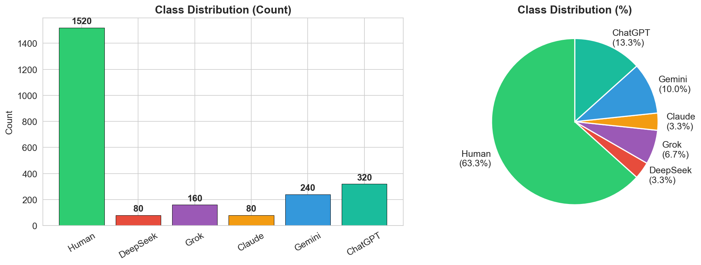
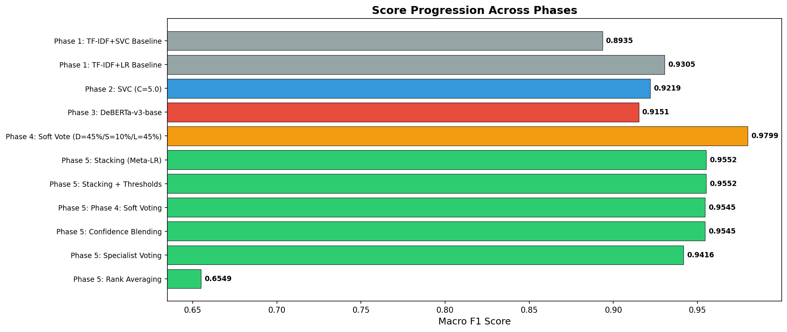
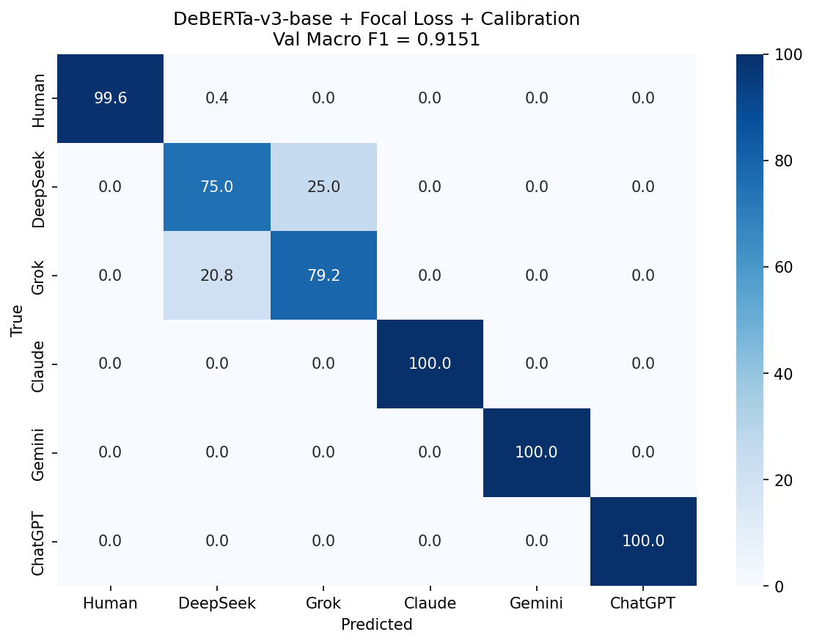
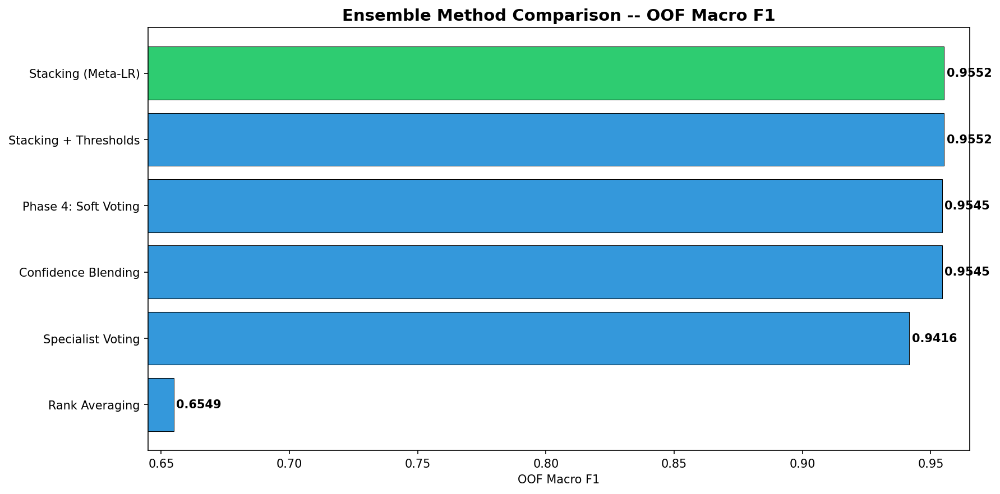

# MALTO -- Human vs. AI-Generated Text Classification# MALTO -- Human vs. AI-Generated Text Classification# Human vs. AI-Generated Text Classification


A multi-class text classification pipeline built for the

[MALTO Recruitment Hackathon](https://www.kaggle.com/competitions/malto-recruitment-hackathon)

hosted by [MALTO](https://malto.ai) and [Politecnico di Torino](https://www.polito.it/).Multi-class text classification pipeline for theMulti-class text classification pipeline distinguishing human-written text from five AI generators (DeepSeek, Grok, Claude, Gemini, ChatGPT).

The goal is to classify text as human-written or identify which of five AI models

generated it (DeepSeek, Grok, Claude, Gemini, ChatGPT).[MALTO Recruitment Hackathon](https://www.kaggle.com/competitions/malto-recruitment-hackathon)


| | |on Kaggle. The task is to distinguish human-written text from five AI generators:**Metric:** Macro F1 Score  

|---|---|

| **Best Public LB** | **0.92170** (Macro F1) |DeepSeek, Grok, Claude, Gemini, and ChatGPT.**Task:** 6-class text classification with severe class imbalance (19:1)

| **Best OOF CV** | **0.9591** (Macro F1) |

| **Competition** | [Kaggle -- MALTO Recruitment Hackathon](https://www.kaggle.com/competitions/malto-recruitment-hackathon) |


---**Best Public LB Score: 0.92170 (Macro F1)**---


## Pipeline


The solution follows an 8-phase pipeline. Each phase produces artifacts consumed by the---## Pipeline Overview

next, making the entire workflow reproducible end-to-end.


| Phase | Notebook | What it does |

|-------|----------|--------------|## Pipeline Overview| Phase | Notebook | Description |

| 1 | [`eda_and_baseline.ipynb`](notebooks/eda_and_baseline.ipynb) | Exploratory data analysis, TF-IDF baselines (LR + SVC) |

| 2 | [`feature_engineering.ipynb`](notebooks/feature_engineering.ipynb) | 46 handcrafted features, 100k TF-IDF dimensions, 10 classifiers ||-------|----------|-------------|

| 3 | [`transformer_finetuning.ipynb`](notebooks/transformer_finetuning.ipynb) | DeBERTa-v3-base fine-tuning with Focal Loss and LLRD |

| 4 | [`ensemble_optimization.ipynb`](notebooks/ensemble_optimization.ipynb) | Weighted soft voting, threshold optimization, pseudo-labeling || Phase | Notebook | Description | Best OOF F1 || 1 -- EDA & Baseline | [`eda_and_baseline.ipynb`](notebooks/eda_and_baseline.ipynb) | Class distribution, text statistics, TF-IDF + LinearSVC / LR baselines |

| 5 | [`advanced_ensemble.ipynb`](notebooks/advanced_ensemble.ipynb) | Stacking meta-learner, rank averaging, confidence-aware blending |

| 6 | [`final_submission.ipynb`](notebooks/final_submission.ipynb) | Score dashboard, submission selection, reproducibility snapshot ||-------|----------|-------------|-------------|| 2 -- Feature Engineering | [`feature_engineering.ipynb`](notebooks/feature_engineering.ipynb) | 46 stylometric features + TF-IDF (100 k dims), 10 classical models, 5-fold CV |

| 7 | [`deberta_kfold_training.ipynb`](notebooks/deberta_kfold_training.ipynb) | DeBERTa 5-fold cross-validation, 3-model weighted voting |

| 8 | [`ensemble_boosting.ipynb`](notebooks/ensemble_boosting.ipynb) | XGBoost and LightGBM for ensemble diversity, 5-model blending || 1 | [`eda_and_baseline.ipynb`](notebooks/eda_and_baseline.ipynb) | EDA, text statistics, TF-IDF + LR/SVC baselines | 0.9305 || 3 -- Transformer | [`transformer_finetuning.ipynb`](notebooks/transformer_finetuning.ipynb) | DeBERTa-v3-base with Focal Loss, LLRD, cosine scheduler, temperature scaling |


Phases 1-6 are sequential. Phases 7-8 build on saved artifacts from earlier phases.| 2 | [`feature_engineering.ipynb`](notebooks/feature_engineering.ipynb) | 46 stylometric features, 100k TF-IDF dims, 10 classical models | 0.9194 || 4 -- Ensemble Optimization | [`ensemble_optimization.ipynb`](notebooks/ensemble_optimization.ipynb) | Weighted soft voting (DeBERTa + SVC + LR), threshold optimization, pseudo-labeling |


---| 3 | [`transformer_finetuning.ipynb`](notebooks/transformer_finetuning.ipynb) | DeBERTa-v3-base with Focal Loss, LLRD, temperature scaling | 0.9151 || 5 -- Advanced Ensemble | [`advanced_ensemble.ipynb`](notebooks/advanced_ensemble.ipynb) | Stacking meta-learner, rank averaging, per-class specialist voting, confidence-aware blending |


## Approach| 4 | [`ensemble_optimization.ipynb`](notebooks/ensemble_optimization.ipynb) | Weighted soft voting, threshold optimization, pseudo-labeling | 0.9552 || 6 -- Final Submission | [`final_submission.ipynb`](notebooks/final_submission.ipynb) | Score dashboard, submission agreement analysis, top-2 selection, reproducibility snapshot |


### Feature Engineering| 5 | [`advanced_ensemble.ipynb`](notebooks/advanced_ensemble.ipynb) | Stacking meta-learner, rank averaging, confidence-aware blending | 0.9552 |


46 handcrafted linguistic and stylometric features are extracted from each text sample,| 6 | [`final_submission.ipynb`](notebooks/final_submission.ipynb) | Score dashboard, submission selection, reproducibility snapshot | -- |> Run notebooks in order: **Phase 1 > 2 > 3 > 4 > 5 > 6**. Each phase saves artifacts into `models/` that the next phase consumes.

including readability scores, character entropy, AI-phrasing indicators, punctuation

patterns, and vocabulary richness metrics. These are combined with TF-IDF vectors| 7 | [`deberta_kfold_training.ipynb`](notebooks/deberta_kfold_training.ipynb) | DeBERTa 5-fold CV, weighted voting with SVC + LR | 0.9500 |

(50k word n-grams + 50k character n-grams) for a total of ~100k input features.

| 8 | [`ensemble_boosting.ipynb`](notebooks/ensemble_boosting.ipynb) | XGBoost + LightGBM diversity, 5-model ensemble, threshold tuning | 0.9591 |## Key Techniques

### Models


**Classical ML** -- LinearSVC (C=5.0) and Logistic Regression (C=2.0), both trained

with balanced class weights and 5-fold stratified cross-validation.> **Execution order:** Phase 1 through 6 run sequentially (each saves artifacts consumed| Technique | Purpose |


**Transformer** -- DeBERTa-v3-base fine-tuned with Focal Loss (gamma=2.0),> by the next). Phases 7 and 8 build on top of Phase 2 and 6 artifacts.|-----------|---------|

layer-wise learning rate decay (LLRD, factor=0.9), cosine learning rate scheduler,

and post-hoc temperature scaling. Trained with 5-fold stratified CV.| Pre-tokenization | Tokenize once, reuse every epoch -- avoids per-batch tokenization bottleneck |


**Tree-based** -- XGBoost and LightGBM trained on the same feature set for ensemble---| Layer-wise Learning Rate Decay (LLRD) | Lower LR for early transformer layers -- proven for DeBERTa fine-tuning |

diversity.

| Focal Loss (γ = 2.0) + class weights | Handle severe class imbalance (19 : 1) |

### Ensemble Strategy

## Key Techniques| Temperature scaling | Calibrate DeBERTa probabilities on a held-out calibration set |

The final prediction blends five base models through optimized weighted soft voting.

A grid search over weight combinations on out-of-fold predictions found the optimal| 4-way data split | Train / Val / Calibration / Test -- prevents information leakage |

blend. Per-class threshold multipliers are then applied to boost recall on minority

classes (DeepSeek and Grok, which together represent only 10% of the training data).| Technique | Purpose || Ensemble weight search | Grid-search optimal soft-voting weights on the calibration set |


---|-----------|---------|| Per-class threshold optimization | Greedy multipliers that boost minority class recall |


## Results| TF-IDF (word + char n-grams) | 100k sparse features capturing lexical and sub-word patterns || Stacking meta-learner | LR trained on 3 × 6 = 18 meta-features learns per-class model trust |


### Score Progression| 46 handcrafted features | Stylometric, readability, entropy, and AI-phrasing indicators || Pseudo-labeling | High-confidence test predictions augment the training set |


| Submission | Method | Public LB || DeBERTa-v3-base | Transformer fine-tuned with Focal Loss (gamma=2.0) and LLRD |

|------------|--------|-----------|

| `01_tfidf_svc_baseline` | TF-IDF + LinearSVC | 0.84123 || 5-fold Stratified CV | Robust out-of-fold probability estimates for all models |## Project Structure

| `05_final_stacking` | Stacking meta-LR (DeBERTa + SVC + LR) | 0.90974 |

| `06_deberta_5fold` | DeBERTa 5-fold only | 0.91648 || Temperature scaling | Post-hoc calibration of DeBERTa logits |

| `07_weighted_vote_best` | Weighted vote (DeBERTa + SVC + LR) | **0.92170** |

| Weighted soft voting | Grid-search optimal blend of DeBERTa + SVC + LR + XGBoost + LightGBM |```

### Per-Class OOF Performance (Best Ensemble)

| Stacking meta-learner | LR/XGB trained on concatenated model probabilities |MALTO/

| Class | F1 | Support |

|-------|----|---------|| Per-class threshold optimization | Greedy multipliers to boost minority-class recall |├── notebooks/

| Human | 0.998 | 1,520 |

| ChatGPT | 0.997 | 320 || Pseudo-labeling | High-confidence test predictions augment training data |│   ├── eda_and_baseline.ipynb           # Phase 1: EDA + TF-IDF baselines

| Gemini | 0.998 | 240 |

| Grok | 0.882 | 160 |│   ├── feature_engineering.ipynb        # Phase 2: 46 features + classical ML

| DeepSeek | 0.791 | 80 |

| Claude | 0.988 | 80 |---│   ├── transformer_finetuning.ipynb     # Phase 3: DeBERTa-v3-base fine-tuning


The main challenge is the DeepSeek/Grok confusion pair -- these two minority classes│   ├── ensemble_optimization.ipynb      # Phase 4: Basic ensemble + pseudo-labeling

are the primary bottleneck for Macro F1.

## Project Structure│   ├── advanced_ensemble.ipynb          # Phase 5: Stacking + advanced ensemble

### Visualizations

│   └── final_submission.ipynb           # Phase 6: Final polish + submission

<p align="center">

  ```├── src/

  

</p>MALTO/│   ├── __init__.py                      # Public API re-exports

<p align="center">

  ├── notebooks/│   ├── features.py                      # extract_features() -- 46 features

  

</p>│   ├── eda_and_baseline.ipynb           # Phase 1: EDA + TF-IDF baselines│   ├── models.py                        # TemperatureScaler, FocalLoss, ensemble utilities


---│   ├── feature_engineering.ipynb        # Phase 2: 46 features + classical ML│   └── utils.py                         # Constants, data loading, submission helpers


## Dataset│   ├── transformer_finetuning.ipynb     # Phase 3: DeBERTa fine-tuning├── figures/                             # All PNG visualizations (git-ignored, regenerated)


| Class | Label | Train Samples | Share |│   ├── ensemble_optimization.ipynb      # Phase 4: Ensemble + pseudo-labeling├── models/                              # Saved weights & artifacts (git-ignored)

|-------|-------|---------------|-------|

| Human | 0 | 1,520 | 63.3% |│   ├── advanced_ensemble.ipynb          # Phase 5: Stacking + advanced ensemble├── checkpoints/                         # Model checkpoints for debugging (git-ignored)

| ChatGPT | 5 | 320 | 13.3% |

| Gemini | 4 | 240 | 10.0% |│   ├── final_submission.ipynb           # Phase 6: Final submission pipeline├── submissions/                         # Kaggle submission CSVs (git-ignored)

| Grok | 2 | 160 | 6.7% |

| DeepSeek | 1 | 80 | 3.3% |│   ├── deberta_kfold_training.ipynb     # Phase 7: DeBERTa 5-fold CV├── train.csv / test.csv                 # Competition data (git-ignored)

| Claude | 3 | 80 | 3.3% |

│   └── ensemble_boosting.ipynb          # Phase 8: XGB/LGB ensemble diversity├── PROJECT_PLAN.md                      # Full 6-phase sprint plan

Total: 2,400 training samples, 600 test samples. Class imbalance ratio up to 19:1.

├── src/└── README.md                            # This file

---

│   ├── __init__.py```

## Project Structure

│   ├── features.py                      # extract_features() -- 46 features

```

MALTO/│   ├── models.py                        # FocalLoss, TemperatureScaler, ensemble utils## Dataset

├── notebooks/                           # Jupyter notebooks (Phases 1-8)

│   ├── eda_and_baseline.ipynb│   └── utils.py                         # Constants, data I/O, submission helpers

│   ├── feature_engineering.ipynb

│   ├── transformer_finetuning.ipynb├── models/                              # Saved weights and configs (git-ignored)| Class | Label | Train Samples | Share |

│   ├── ensemble_optimization.ipynb

│   ├── advanced_ensemble.ipynb├── checkpoints/                         # Model checkpoints (git-ignored)|-------|-------|---------------|-------|

│   ├── final_submission.ipynb

│   ├── deberta_kfold_training.ipynb├── submissions/                         # Kaggle submission CSVs| Human | 0 | 1 520 | 63.3 % |

│   └── ensemble_boosting.ipynb

├── src/                                 # Reusable Python modules├── figures/                             # Visualization PNGs| ChatGPT | 5 | 320 | 13.3 % |

│   ├── __init__.py

│   ├── features.py                      # 46 feature extractors├── competition_info.json                # Competition metadata| Gemini | 4 | 240 | 10.0 % |

│   ├── models.py                        # FocalLoss, TemperatureScaler, ensembles

│   └── utils.py                         # Constants, I/O helpers├── PROJECT_PLAN.md                      # Detailed phase-by-phase plan| Grok | 2 | 160 | 6.7 % |

├── models/                              # Saved model configs (JSON tracked, binaries git-ignored)

├── checkpoints/                         # DeBERTa checkpoints (git-ignored)└── README.md| DeepSeek | 1 | 80 | 3.3 % |

├── submissions/                         # Kaggle submission CSVs

├── figures/                             # Visualization outputs```| Claude | 3 | 80 | 3.3 % |

├── competition_info.json

├── requirements.txt

├── LICENSE

├── PROJECT_PLAN.md---## Environment

└── README.md

```


---## Dataset- **Python 3.9** · PyTorch 2.8 · Transformers 4.57


## Getting Started- Memory-safe training settings: `BATCH_SIZE=2`, `GRAD_ACCUM=8` (effective batch = 16), `MAX_LEN=512`


```bash| Class | Label | Train Samples | Share |

# Clone the repository

git clone https://github.com/aliivaezii/MALTO.git|-------|-------|---------------|-------|## Competition Rules

cd MALTO

| Human | 0 | 1,520 | 63.3% |

# Create virtual environment

python3 -m venv .venv| ChatGPT | 5 | 320 | 13.3% |- Pre-trained AI detectors forbidden

source .venv/bin/activate

| Gemini | 4 | 240 | 10.0% |- External data forbidden

# Install dependencies

pip install -r requirements.txt| Grok | 2 | 160 | 6.7% |- Individual competition only


# Place train.csv and test.csv in the project root, then run notebooks in order| DeepSeek | 1 | 80 | 3.3% |

```| Claude | 3 | 80 | 3.3% |


------


## Environment## Score Progression


| Component | Version || Submission | Method | Public LB |

|-----------|---------||------------|--------|-----------|

| Python | 3.9 || `01_tfidf_svc_baseline` | TF-IDF + LinearSVC | 0.84123 |

| PyTorch | 2.8 || `05_final_stacking` | Stacking meta-LR (DeBERTa + SVC + LR) | 0.90974 |

| Transformers | 4.57 || `06_deberta_5fold` | DeBERTa 5-fold only | 0.91648 |

| scikit-learn | 1.6 || `07_weighted_vote_best` | Weighted vote (DeBERTa 0.65 + SVC 0.25 + LR 0.10) | **0.92170** |

| XGBoost | 2.1 |

| LightGBM | 4.6 |---

| Hardware | MacBook M4 Air (MPS) |

## Environment

Training configuration: `BATCH_SIZE=2`, `GRAD_ACCUM=8` (effective batch size 16),

`MAX_LEN=512`.- Python 3.9, PyTorch 2.8, Transformers 4.57

- scikit-learn 1.6, XGBoost 2.1, LightGBM 4.6

---- Hardware: MacBook M4 Air (MPS backend)

- Training config: `BATCH_SIZE=2`, `GRAD_ACCUM=8` (effective 16), `MAX_LEN=512`

## Competition Rules

## Competition Rules

- Pre-trained AI detectors are forbidden

- External data is forbidden- Pre-trained AI detectors are forbidden

- Individual competition only- External data is forbidden

- Individual competition only

---

## License

This project is released under the [MIT License](LICENSE).
